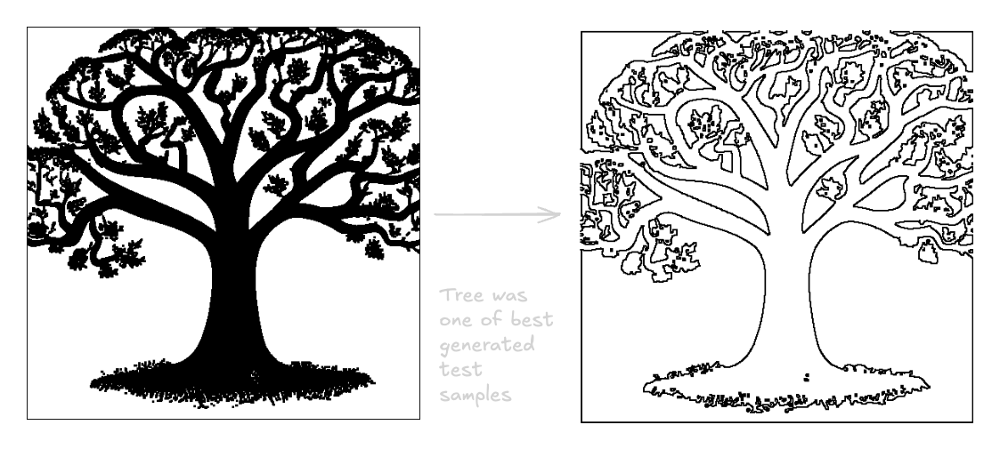

# Stencil-AI

Generate clean, print-ready stencils using AI or traditional computer vision.

## Two Approaches

###  **StencilCV.py** - Computer Vision Approach 
Convert existing images to stencils using classical CV techniques. [More info here](./StencilAI/STENCILCV_GUIDE.md)

```python
from StencilCV import StencilCV

processor = StencilCV()
stencil = processor.auto_stencil("photo.jpg", style='outline')
processor.save(stencil, "output_stencil.png")
```
#### Sample


**Pros:**
-  Very fast (~0.1 seconds)
-  Deterministic - same input = same output
-  Guaranteed clean black/white output
-  No GPU required
- Full control over parameters

**Cons:**
- Requires input images
- Quality depends on input

**Best for:** Converting photos/drawings to stencils, batch processing

---

###  **Stencil.py** - AI-Powered Generationv
Generate stencils from text descriptions using Stable Diffusion.

```python
from Stencil import StencilGenerator

generator = StencilGenerator()
stencil = generator.generate("a cat sitting")
generator.save_image(stencil, "cat_stencil.png")
```

**Pros:**
- Create designs from text prompts
- No input images needed
- Generate original artwork

**Cons:**
- Slower (~10-30 seconds)
- Unpredictable results
- May crop subjects or generate multiple objects
- Requires GPU (recommended)

**Best for:** Creating new designs from imagination

---
### Stencil AI-Gen with CV outline


## Installation

```bash
# Clone the repository
git clone <repo-url>
cd Stencil-AI

# Install dependencies
pip install -r requirements.txt
```

### Minimal Install (CV only)
If you only want StencilCV (no AI):
```bash
pip install opencv-python numpy pillow
```

### Full Install (AI + CV)
For both approaches:
```bash
pip install -r requirements.txt
```

## Quick Start

### StencilCV (Traditional CV) 

```python
from StencilCV import StencilCV

processor = StencilCV()

# Three stencil styles:

# 1. Filled silhouette (most common)
filled = processor.auto_stencil('photo.jpg', style='filled')
processor.save(filled, 'filled.png')

# 2. Outline/edges (line art)
outline = processor.auto_stencil('photo.jpg', style='outline')
processor.save(outline, 'outline.png')

# 3. Hybrid (edges + fill)
hybrid = processor.auto_stencil('photo.jpg', style='hybrid')
processor.save(hybrid, 'hybrid.png')
```

**See [STENCILCV_GUIDE.md](./StencilAI/STENCILCV_GUIDE.md) for complete documentation**

### Stencil.py (AI Generation)

```python
from Stencil import StencilGenerator

generator = StencilGenerator()

# Generate from text
stencil = generator.generate("a bicycle")
generator.save_image(stencil, "bicycle.png")

# Multiple images with different seeds
for i in range(5):
    stencil = generator.generate("a cat", seed=42+i)
    generator.save_image(stencil, f"cat_{i}.png")
```

**See [APPROACH.md](./StencilAI/APPROACH.md) for limitations and best practices**

## Hybrid Workflow (Best Results)

Combine both for best results: AI generates, CV perfects.

```python
from Stencil import StencilGenerator
from StencilCV import StencilCV

# Generate with AI
ai_gen = StencilGenerator()
ai_image = ai_gen.generate("a tree", clean_background=False)

# Perfect with CV
cv_proc = StencilCV()
final_stencil = cv_proc.silhouette_stencil(ai_image)
cv_proc.save(final_stencil, "tree_perfect.png")
```

## Which Approach Should I Use?

### Use **StencilCV** when:
-  You have existing images to convert
-  You need fast, batch processing
-  You want predictable, consistent results
-  You don't have a GPU
-  Quality and precision matter

### Use **Stencil.py (AI)** when:
-  You need to generate from text descriptions
-  You don't have input images
-  You're exploring creative ideas
-  You have a GPU available

### Use **Both (Hybrid)** when:
-  You want the best quality
-  AI generates, CV perfects
-  You have time for two-step process

## Documentation

- **[STENCILCV_GUIDE.md](./StencilAI/STENCILCV_GUIDE.md)** - Complete guide for traditional CV approach 
- **[APPROACH.md](./StencilAI/APPROACH.md)** - AI approach, limitations, and workarounds
- **[DEPLOYMENT.md](./StencilAI/DEPLOYMENT.md)** - Deploy the Gradio web interface

## Web Interface (AI Only)

Launch a web UI for the AI generator:

```bash
python app.py
```

Then open http://localhost:7860 in your browser.

## Hardware Requirements

### For StencilCV:
- Any modern CPU
- 4GB+ RAM
- No GPU required

### For Stencil.py (AI):
- CPU: Works but slow (~2-5 minutes per image)
- GPU (CUDA): Recommended (~10-30 seconds per image)
  - Minimum 6GB VRAM for 512x512 images
  - 8GB+ VRAM recommended

## Examples

Run the example scripts:

```bash
# AI examples
python Stencil.py

# CV examples
python StencilCV.py
```

## Performance Comparison

| Operation | StencilCV | Stencil.py (AI) |
|-----------|-----------|-----------------|
| Single image | ~0.1s | ~10-30s |
| 100 images | ~10s | ~30-50 minutes |
| GPU required | No | Recommended |
| Memory usage | ~200MB | ~5GB+ |

## Tips for Best Results

### StencilCV Tips:
1. Use high-quality, well-lit input images
2. Simple backgrounds work best
3. Start with `auto_stencil()` then customize
4. Try different styles: 'filled', 'outline', 'hybrid'

### AI Tips:
1. Keep prompts simple: "a cat" not "a majestic feline creature"
2. Generate multiple images (different seeds)
3. Use wider aspect ratios for wide subjects: `width=640, height=512`
4. Always use `clean_background=True`
5. Consider using AI → CV hybrid workflow

## Troubleshooting

### Import errors
```bash
pip install --upgrade opencv-python numpy pillow
```

### AI model won't load
```bash
# Check GPU availability
python -c "import torch; print(torch.cuda.is_available())"
```

### StencilCV produces noisy output
```python
# Increase noise removal
stencil = processor.silhouette_stencil(
    'image.jpg',
    remove_small_objects=2000,  # Increase this
    smooth_edges=True
)
```

## License

This project uses open-source models and libraries. Check individual model licenses on Hugging Face for commercial use restrictions.

---

**Recommendation:** Start with **StencilCV** for reliable, fast results. Use AI when you need to generate designs from text.
